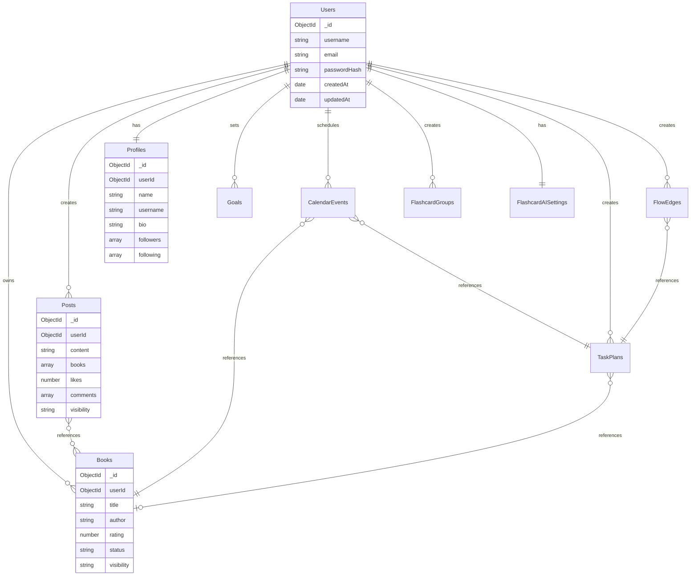

# MongoDB Schema Design for Study-Multiply-Go-Beyond

## Overview

This document outlines the comprehensive MongoDB schema design for the Study-Multiply-Go-Beyond application, focusing on proper user data separation, performance optimization, and data integrity.

## Key Entities Identified

Based on the frontend data analysis, the following entities need to be modeled:

1. **Users** - User accounts and authentication
2. **Books** - User's book collections
3. **Posts** - Social posts with book references
4. **Profiles** - User profile information
5. **Goals** - User learning goals
6. **Calendar Events** - Scheduled study events
7. **Flashcard Groups** - Flashcard collections
8. **Flashcard AI Settings** - User preferences for AI-generated flashcards
9. **Task Plans** - Study plans with tasks
10. **Flow Edges** - Task flow connections
11. **Tags** - Global tags system

## Collection Schemas

### 1. Users Collection

```javascript
{
  _id: ObjectId,
  username: String, // Unique username
  email: String, // Unique email
  passwordHash: String, // Hashed password
  createdAt: Date,
  updatedAt: Date,
  lastLoginAt: Date,
  isActive: Boolean,
  preferences: {
    language: String, // Default: 'en'
    theme: String, // 'light' | 'dark'
    timezone: String
  }
}
```

### 2. Books Collection

```javascript
{
  _id: ObjectId,
  userId: ObjectId, // Reference to Users collection
  title: String,
  author: String,
  year: Number,
  cover: String, // URL to cover image
  description: String,
  tags: [String],
  rating: Number, // 1-5 scale
  status: String, // 'reading' | 'completed' | 'want-to-read' | 'abandoned'
  visibility: String, // 'public' | 'private'
  pages: Number,
  publisher: String,
  language: String,
  createdAt: Date,
  updatedAt: Date,
  isbn: String, // Optional ISBN for better book identification
  userNotes: String, // Private notes for the user
  startDate: Date, // When user started reading
  finishDate: Date, // When user finished reading
  progress: Number, // Percentage completed (0-100)
  favorite: Boolean // User's favorite books
}
```

### 3. Posts Collection

```javascript
{
  _id: ObjectId,
  userId: ObjectId, // Reference to Users collection
  content: String,
  books: [ObjectId], // References to Books collection
  likes: Number,
  comments: [{
    userId: ObjectId, // Reference to Users collection
    content: String,
    createdAt: Date
  }],
  tags: [String],
  visibility: String, // 'public' | 'followers' | 'private'
  createdAt: Date,
  updatedAt: Date,
  isEdited: Boolean,
  editedAt: Date
}
```

### 4. Profiles Collection

```javascript
{
  _id: ObjectId,
  userId: ObjectId, // Reference to Users collection (1:1 relationship)
  name: String,
  username: String, // Unique display username
  bio: String,
  profileImage: String, // URL to profile image
  backgroundImage: String, // URL to background image
  location: String,
  joined: Date,
  followers: [ObjectId], // References to Users collection
  following: [ObjectId], // References to Users collection
  posts: Number, // Post count (denormalized for performance)
  tags: [String], // User's interest tags
  socialLinks: {
    website: String,
    twitter: String,
    github: String
  },
  stats: {
    booksRead: Number,
    studyStreak: Number,
    totalStudyHours: Number
  },
  privacy: {
    showEmail: Boolean,
    showLocation: Boolean,
    allowFollowers: Boolean
  },
  createdAt: Date,
  updatedAt: Date
}
```

### 5. Goals Collection

```javascript
{
  _id: ObjectId,
  userId: ObjectId, // Reference to Users collection
  text: String,
  isPublic: Boolean,
  category: String, // 'academic' | 'personal' | 'career'
  priority: String, // 'low' | 'medium' | 'high'
  targetDate: Date, // Optional target completion date
  status: String, // 'active' | 'completed' | 'paused'
  progress: Number, // Percentage completed (0-100)
  createdAt: Date,
  updatedAt: Date,
  completedAt: Date
}
```

### 6. Calendar Events Collection

```javascript
{
  _id: ObjectId,
  userId: ObjectId, // Reference to Users collection
  date: Date, // Date key (YYYY-MM-DD format)
  events: [{
    id: String, // Unique event ID within the date
    title: String,
    description: String,
    startTime: String, // HH:MM format
    endTime: String, // HH:MM format
    category: String, // 'study' | 'exam' | 'assignment' | 'other'
    priority: String, // 'low' | 'medium' | 'high'
    completed: Boolean,
    relatedBookId: ObjectId, // Optional reference to Books collection
    relatedTaskId: ObjectId, // Optional reference to Tasks in Task Plans
    color: String, // Hex color code for calendar display
    reminder: {
      enabled: Boolean,
      minutesBefore: Number
    }
  }],
  createdAt: Date,
  updatedAt: Date
}
```

### 7. Flashcard Groups Collection

```javascript
{
  _id: ObjectId,
  userId: ObjectId, // Reference to Users collection
  name: String,
  description: String,
  cards: [{
    id: Number, // Sequential ID within the group
    question: String,
    answer: String,
    category: String,
    easyCount: Number, // Times marked as easy
    lastReviewed: Date,
    nextReview: Date, // For spaced repetition
    difficulty: Number, // 0-2 scale (0=easy, 1=medium, 2=hard)
    reviewCount: Number,
    correctCount: Number,
    createdAt: Date,
    updatedAt: Date
  }],
  nextCardId: Number, // For generating new card IDs
  isPublic: Boolean, // For sharing decks
  category: String, // Subject category
  tags: [String],
  stats: {
    totalCards: Number,
    masteredCards: Number,
    reviewingCards: Number,
    newCards: Number
  },
  createdAt: Date,
  updatedAt: Date,
  lastStudiedAt: Date
}
```

### 8. Flashcard AI Settings Collection

```javascript
{
  _id: ObjectId,
  userId: ObjectId, // Reference to Users collection (1:1 relationship)
  language: String, // 'en' | 'es' | 'fr' | 'de' | 'ja'
  apiKey: String, // Encrypted API key for external AI service
  preferences: {
    defaultCardCount: Number, // Default number of cards to generate
    difficulty: String, // 'beginner' | 'intermediate' | 'advanced'
    includeImages: Boolean,
    autoTranslate: Boolean
  },
  usageStats: {
    totalCardsGenerated: Number,
    lastUsed: Date,
    monthlyUsage: [{
      month: String, // YYYY-MM format
      count: Number
    }]
  },
  createdAt: Date,
  updatedAt: Date
}
```

### 9. Task Plans Collection

```javascript
{
  _id: ObjectId,
  userId: ObjectId, // Reference to Users collection
  title: String,
  description: String,
  status: String, // 'not-started' | 'in-progress' | 'completed' | 'paused'
  tasks: [{
    id: String, // Unique task ID within the plan
    title: String,
    description: String,
    status: String, // 'not-started' | 'in-progress' | 'completed'
    priority: String, // 'low' | 'medium' | 'high'
    createdAt: Date,
    startAt: Date,
    dueDate: Date,
    completedAt: Date,
    estimatedHours: Number,
    actualHours: Number,
    tags: [String],
    dependencies: [String], // IDs of tasks that must be completed first
    relatedBookId: ObjectId, // Optional reference to Books collection
    subtasks: [{
      id: String,
      title: String,
      completed: Boolean,
      completedAt: Date
    }]
  }],
  dueDate: Date, // Plan due date
  category: String, // 'academic' | 'personal' | 'work'
  tags: [String],
  isPublic: Boolean,
  collaborators: [ObjectId], // References to Users collection
  createdAt: Date,
  updatedAt: Date,
  completedAt: Date
}
```

### 10. Flow Edges Collection

```javascript
{
  _id: ObjectId,
  userId: ObjectId, // Reference to Users collection
  planId: ObjectId, // Reference to Task Plans collection
  edges: [{
    id: String, // Unique edge ID
    source: String, // Source task ID
    target: String, // Target task ID
    type: String, // 'dependency' | 'sequence' | 'related'
    style: {
      type: String, // 'straight' | 'smoothstep' | 'bezier'
      animated: Boolean,
      color: String,
      width: Number
    },
    label: String, // Optional edge label
    createdAt: Date,
    updatedAt: Date
  }],
  createdAt: Date,
  updatedAt: Date
}
```

### 11. Tags Collection

```javascript
{
  _id: ObjectId,
  name: String, // Unique tag name
  category: String, // 'subject' | 'skill' | 'general'
  description: String,
  color: String, // Hex color for UI display
  usageCount: Number, // How many times this tag is used
  isSystem: Boolean, // System-generated vs user-created
  relatedTags: [ObjectId], // References to related tags
  createdAt: Date,
  updatedAt: Date
}
```

## Indexing Strategy

### Users Collection

```javascript
// Unique indexes
db.users.createIndex({ username: 1 }, { unique: true });
db.users.createIndex({ email: 1 }, { unique: true });

// Performance indexes
db.users.createIndex({ isActive: 1 });
db.users.createIndex({ createdAt: 1 });
```

### Books Collection

```javascript
// User-specific queries
db.books.createIndex({ userId: 1 });

// Search and filtering
db.books.createIndex({ title: "text", author: "text", description: "text" });
db.books.createIndex({ tags: 1 });
db.books.createIndex({ status: 1 });
db.books.createIndex({ visibility: 1 });

// Compound indexes for common queries
db.books.createIndex({ userId: 1, status: 1 });
db.books.createIndex({ userId: 1, visibility: 1, rating: -1 });
db.books.createIndex({ userId: 1, tags: 1 });
```

### Posts Collection

```javascript
// User-specific and timeline queries
db.posts.createIndex({ userId: 1 });
db.posts.createIndex({ createdAt: -1 });

// Social features
db.posts.createIndex({ visibility: 1, createdAt: -1 });
db.posts.createIndex({ books: 1 });
db.posts.createIndex({ tags: 1 });

// Compound indexes
db.posts.createIndex({ userId: 1, createdAt: -1 });
db.posts.createIndex({ visibility: 1, likes: -1 });
```

### Profiles Collection

```javascript
// Unique and lookup indexes
db.profiles.createIndex({ userId: 1 }, { unique: true });
db.profiles.createIndex({ username: 1 }, { unique: true });

// Social features
db.profiles.createIndex({ followers: 1 });
db.profiles.createIndex({ following: 1 });
db.profiles.createIndex({ tags: 1 });
```

### Goals Collection

```javascript
// User-specific queries
db.goals.createIndex({ userId: 1 });
db.goals.createIndex({ userId: 1, status: 1 });
db.goals.createIndex({ userId: 1, isPublic: 1 });

// Time-based queries
db.goals.createIndex({ targetDate: 1 });
db.goals.createIndex({ createdAt: -1 });
```

### Calendar Events Collection

```javascript
// User-specific and date queries
db.calendarEvents.createIndex({ userId: 1 });
db.calendarEvents.createIndex({ userId: 1, date: 1 });

// Event-specific queries
db.calendarEvents.createIndex({ "events.category": 1 });
db.calendarEvents.createIndex({ "events.priority": 1 });
db.calendarEvents.createIndex({ "events.relatedBookId": 1 });
```

### Flashcard Groups Collection

```javascript
// User-specific queries
db.flashcardGroups.createIndex({ userId: 1 });
db.flashcardGroups.createIndex({ userId: 1, isPublic: 1 });

// Search and filtering
db.flashcardGroups.createIndex({ name: "text", description: "text" });
db.flashcardGroups.createIndex({ category: 1 });
db.flashcardGroups.createIndex({ tags: 1 });

// Study optimization
db.flashcardGroups.createIndex({ "cards.nextReview": 1 });
```

### Flashcard AI Settings Collection

```javascript
// User-specific lookup
db.flashcardAISettings.createIndex({ userId: 1 }, { unique: true });
```

### Task Plans Collection

```javascript
// User-specific queries
db.taskPlans.createIndex({ userId: 1 });
db.taskPlans.createIndex({ userId: 1, status: 1 });

// Task-specific queries
db.taskPlans.createIndex({ "tasks.dueDate": 1 });
db.taskPlans.createIndex({ "tasks.status": 1 });
db.taskPlans.createIndex({ dueDate: 1 });
db.taskPlans.createIndex({ tags: 1 });
```

### Flow Edges Collection

```javascript
// Plan-specific queries
db.flowEdges.createIndex({ userId: 1 });
db.flowEdges.createIndex({ planId: 1 }, { unique: true });
```

### Tags Collection

```javascript
// Unique and search indexes
db.tags.createIndex({ name: 1 }, { unique: true });
db.tags.createIndex({ category: 1 });
db.tags.createIndex({ usageCount: -1 });
```

## Relationships and References

### User-Centric Relationships

- All user-specific data includes `userId` field referencing the Users collection
- One-to-one relationships: Users ? Profiles, Users ? Flashcard AI Settings
- One-to-many relationships: Users → Books, Users → Posts, Users → Goals, etc.

### Cross-Collection References

- Posts reference Books through `books` array
- Calendar Events can reference Books and Tasks
- Task Plans can reference Books
- Flow Edges reference Task Plans

### Social Relationships

- Profiles contain arrays of follower/following user IDs
- Posts can be filtered by visibility (public, followers, private)

## User Data Separation Strategy

### 1. Document-Level Separation

- Every user-specific collection includes a `userId` field
- All queries must include `userId` filter to ensure data isolation

### 2. Access Control Patterns

```javascript
// Middleware example for ensuring user data separation
function ensureUserAccess(req, res, next) {
  const query = req.query || {};
  const userId = req.user.id;

  // Automatically add userId filter to all queries
  if (query.userId && query.userId !== userId) {
    return res.status(403).json({ error: "Access denied" });
  }

  query.userId = userId;
  req.query = query;
  next();
}
```

### 3. Database-Level Security

- Implement MongoDB role-based access control
- Create user-specific views for additional security
- Use field-level encryption for sensitive data

### 4. Data Validation

- Server-side validation to ensure `userId` cannot be modified by clients
- Audit logs for data access patterns

## Data Validation Rules

### Users Collection

```javascript
{
  $jsonSchema: {
    bsonType: "object",
    required: ["username", "email", "passwordHash"],
    properties: {
      username: {
        bsonType: "string",
        minLength: 3,
        maxLength: 30,
        pattern: "^[a-zA-Z0-9_]+$"
      },
      email: {
        bsonType: "string",
        pattern: "^[a-zA-Z0-9._%+-]+@[a-zA-Z0-9.-]+\\.[a-zA-Z]{2,}$"
      },
      passwordHash: {
        bsonType: "string",
        minLength: 60,
        maxLength: 60 // bcrypt hash length
      }
    }
  }
}
```

### Books Collection

```javascript
{
  $jsonSchema: {
    bsonType: "object",
    required: ["userId", "title", "author"],
    properties: {
      userId: {
        bsonType: "objectId"
      },
      title: {
        bsonType: "string",
        minLength: 1,
        maxLength: 200
      },
      author: {
        bsonType: "string",
        minLength: 1,
        maxLength: 100
      },
      rating: {
        bsonType: "number",
        minimum: 1,
        maximum: 5
      },
      status: {
        enum: ["reading", "completed", "want-to-read", "abandoned"]
      },
      visibility: {
        enum: ["public", "private"]
      },
      progress: {
        bsonType: "number",
        minimum: 0,
        maximum: 100
      }
    }
  }
}
```

### Posts Collection

```javascript
{
  $jsonSchema: {
    bsonType: "object",
    required: ["userId", "content"],
    properties: {
      userId: {
        bsonType: "objectId"
      },
      content: {
        bsonType: "string",
        minLength: 1,
        maxLength: 2000
      },
      books: {
        bsonType: "array",
        items: {
          bsonType: "objectId"
        }
      },
      likes: {
        bsonType: "number",
        minimum: 0
      },
      visibility: {
        enum: ["public", "followers", "private"]
      }
    }
  }
}
```

## Migration Considerations

### 1. Data Type Conversion

- Convert string IDs to ObjectIds for proper references
- Transform date strings to proper Date objects
- Normalize rating scales and status values

### 2. Data Structure Changes

- Flatten nested objects where appropriate for better query performance
- Separate embedded documents into referenced collections when needed
- Add missing fields with default values

### 3. Migration Strategy

```javascript
// Example migration script for Books collection
db.books_temp.insertMany(
  db.books.find().map((book) => ({
    ...book,
    _id: new ObjectId(),
    userId: new ObjectId(book.userId || "default_user_id"),
    createdAt: new Date(book.createdAt || Date.now()),
    updatedAt: new Date(),
    progress: book.progress || 0,
    favorite: book.favorite || false,
  }))
);

// Verify data integrity
db.books_temp.validate();

// Replace collection
db.books.drop();
db.books_temp.renameCollection("books");
```

### 4. Backward Compatibility

- Maintain API compatibility during transition
- Implement versioning for data structures
- Create data transformation utilities

## Example Documents

### User Document

```javascript
{
  _id: ObjectId("64f8a1b2c3d4e5f6a7b8c9d0"),
  username: "student123",
  email: "student@example.com",
  passwordHash: "$2b$10$abcdefghijklmnopqrstuvwxyz1234567890",
  createdAt: ISODate("2024-01-15T10:30:00Z"),
  updatedAt: ISODate("2024-01-15T10:30:00Z"),
  lastLoginAt: ISODate("2024-01-20T14:22:00Z"),
  isActive: true,
  preferences: {
    language: "en",
    theme: "light",
    timezone: "Asia/Tokyo"
  }
}
```

### Book Document

```javascript
{
  _id: ObjectId("64f8a1b2c3d4e5f6a7b8c9d1"),
  userId: ObjectId("64f8a1b2c3d4e5f6a7b8c9d0"),
  title: "化学基礎・化学 セミナー",
  author: "第一学習社",
  year: 2023,
  cover: "https://m.media-amazon.com/images/I/71bjp1HzSYL._AC_UF1000,1000_QL80_.jpg",
  description: "大学共通テストと個別試験に対応した化学の総合問題集。",
  tags: ["化学", "理科", "大学受験"],
  rating: 5,
  status: "reading",
  visibility: "public",
  pages: 480,
  publisher: "第一学習社",
  language: "日本語",
  createdAt: ISODate("2024-01-15T10:30:00Z"),
  updatedAt: ISODate("2024-01-15T10:30:00Z"),
  progress: 35,
  favorite: false,
  startDate: ISODate("2024-01-15T10:30:00Z")
}
```

### Post Document

```javascript
{
  _id: ObjectId("64f8a1b2c3d4e5f6a7b8c9d2"),
  userId: ObjectId("64f8a1b2c3d4e5f6a7b8c9d0"),
  content: "「編入数学徹底研究」 is a staple comprehensive exercise book for transfer students.",
  books: [ObjectId("64f8a1b2c3d4e5f6a7b8c9d1")],
  likes: 87,
  comments: [
    {
      userId: ObjectId("64f8a1b2c3d4e5f6a7b8c9d3"),
      content: "Great book recommendation!",
      createdAt: ISODate("2024-01-16T12:00:00Z")
    }
  ],
  tags: ["transfer exam", "mathematics", "book review"],
  visibility: "public",
  createdAt: ISODate("2024-01-15T14:30:00Z"),
  updatedAt: ISODate("2024-01-15T14:30:00Z"),
  isEdited: false
}
```

## Security Considerations

### 1. Data Access Control

- Implement row-level security using `userId` filtering
- Use MongoDB's built-in role-based access control
- Create database users with minimal required permissions

### 2. Sensitive Data Protection

- Encrypt passwords using bcrypt
- Encrypt API keys and other sensitive configuration
- Use TLS for all database connections

### 3. Input Validation

- Sanitize all user inputs before database operations
- Implement parameterized queries to prevent injection
- Validate data types and ranges

### 4. Audit and Monitoring

- Log all data access operations
- Monitor for unusual access patterns
- Implement rate limiting for API endpoints

### 5. Privacy Compliance

- Implement data deletion capabilities for GDPR compliance
- Provide data export functionality
- Maintain audit trails for data modifications

## Performance Optimization

### 1. Query Optimization

- Use appropriate indexes for common query patterns
- Implement pagination for large result sets
- Use aggregation pipelines for complex queries

### 2. Caching Strategy

- Implement Redis caching for frequently accessed data
- Cache user sessions and authentication tokens
- Use application-level caching for expensive operations

### 3. Database Configuration

- Configure appropriate connection pool sizes
- Implement read replicas for read-heavy operations
- Use sharding for large-scale deployments

## Relationship Diagram



## Conclusion

This MongoDB schema design provides a comprehensive foundation for the Study-Multiply-Go-Beyond application with:

1. **Proper User Data Separation**: All user-specific data is isolated through `userId` fields
2. **Performance Optimization**: Strategic indexing for common query patterns
3. **Data Integrity**: Validation rules and proper relationships between collections
4. **Security**: Access control patterns and data protection measures
5. **Scalability**: Flexible schema design that can grow with the application

The schema balances normalization with performance considerations, using embedded documents where appropriate while maintaining references for complex relationships. The design supports the application's social features, study tools, and personalization requirements while ensuring data security and user privacy.
